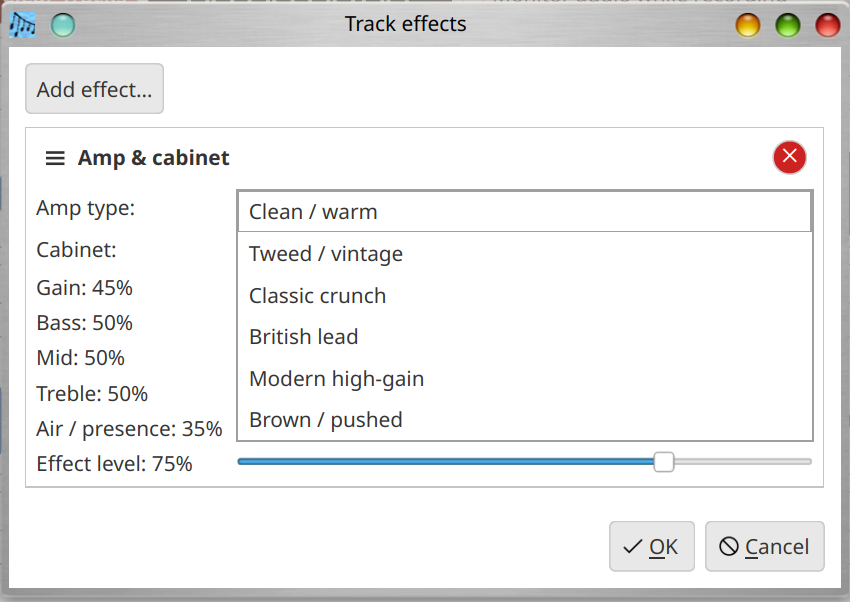
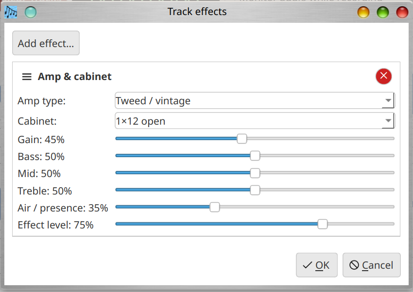

# Musician's Canvas

This is a multi-track music recording application for desktop PCs. This is written in C++ and uses Qt for
the GUI library. This application is meant to be built for Linux, Windows, and Mac OS. Ease of use is a
main design consideration.  This project started as an experiment with Cursor (AI coding tool) to see what
it would be able to create as far as an application like this, with continued use of AI development as well
as traditional software development.

Years ago, I made a multi-track music recording program in college (with the same name); this is an attempt
to make something better.

## Features

- **Multi-track arrangement**: Add and remove multiple tracks to compose songs
- **Named tracks**: Each track has an editable name used as the filename for recorded audio
- **Track types**: Configure each track for audio recording (from microphone/line-in) or MIDI recording (from keyboard/controller); click the track type icon to quickly change the input source
- **Track arming**: Check "Arm" on a track to select it as the recording target; only one track can be armed at a time. A single unrecorded track is automatically armed for convenience
- **Recording countdown**: A 3-second visual countdown before recording begins, giving the performer time to prepare
- **Overdub recording**: When recording a new track while existing tracks are enabled, the existing tracks are mixed and played back in real time so you can hear them while recording. Playback and capture are synchronized to keep all tracks aligned
- **Drag-and-drop import**: While a project is open, drag one or more supported audio files (`.wav`, `.flac`, `.mp3`, `.ogg`, `.aiff`, `.aif`, `.aifc`) from the file manager onto the main window to add them as new audio tracks. Files outside the project directory are copied in automatically; the file's base name becomes the new track name. The list of supported formats is centralised in `src/audioformats.h` and `src/audioformats.cpp`.
- **Visual feedback**: Audio waveform display for audio tracks (with live level meter during recording), MIDI piano roll for MIDI tracks
- **Built-in MIDI synthesizer**: Renders MIDI tracks to audio using FluidSynth with a configurable SoundFont
- **Mix to single audio file**: Export all enabled tracks to a single mixed file (WAV, FLAC, MP3, Ogg Vorbis, or AIFF) using the [audio_mixer_cpp](https://github.com/EricOulashin/audio_mixer_cpp) library (via **Tools → Mix tracks to file**). Encoding uses the same classes as the sibling project (`MP3File`, `OggFile`, `AiffFile`) together with **libsndfile**.
- **Save / Open project**: Serialize and restore the full project (tracks, names, types, MIDI notes, audio file references) to/from a JSON file, with unsaved-changes detection on exit
- **Project-specific settings**: Override global MIDI and audio defaults per project (sample rate, SoundFont, MIDI device)
- **PortAudio capture (optional build)**: When the project is built with PortAudio (`HAVE_PORTAUDIO`), recording can use a native PortAudio input path (similar in spirit to Audacity) instead of Qt Multimedia. **Project → Project Settings → Audio** lets you choose **PortAudio** or **Qt Multimedia** and pick a PortAudio input device. If PortAudio is not installed, the build still succeeds and recording uses Qt Multimedia only.
- **High-quality sample-rate conversion**: Records at the audio device's native rate and converts to the project rate using windowed sinc interpolation (Kaiser-windowed, ~96 dB stopband attenuation), the same algorithm family used by Audacity / libsoxr. This allows recording at any project sample rate (8000 Hz to 192000 Hz) regardless of the device's native rate, with no pitch or duration change.
- **Automatic mono/stereo handling**: Detects physically-mono devices advertised as stereo (common with USB webcam mics on PipeWire) and converts between mono and stereo as needed (duplication or averaging), matching Audacity's channel-routing approach
- **Recording insert effects (audio tracks)**: Use the **Effects** button (under **Options** on each audio track) to open the **Track effects** dialog. Add and configure **Reverb**, **Chorus**, **Flanger**, **Overdrive / distortion**, and **Amp & cabinet** modeling, drag the **≡** grip to reorder the chain (top runs first), and save with the project. Effects are applied to the recorded take when you stop recording; parameters are in real-world units (ms, Hz) so behaviour stays consistent across mono or stereo and typical project sample rates (8 kHz–192 kHz) after capture is normalized. See the [user manual](docs/MusiciansCanvas_User_Manual.md) for usage details. Translators can bulk-update the effect strings via `scripts/effect_i18n.tsv` (generated by `scripts/build_effect_tsv.py`) and `scripts/fill_effect_i18n.py` after `lupdate`.
- **Mix effects (master bus)**: **Project → Project Settings → Mix Effects** configures an effect chain on the **entire mix** — the same types and ordering as track effects. It runs when you **play all tracks** and when you **mix tracks to a file** (any supported export format). Settings are stored per project in `project.json` as `mixEffectChain`.
- **Anti-clipping on effect output**: The built-in effect DSP soft-limits samples before 16-bit PCM to reduce harsh digital clipping. **EffectWidget** provides `guardFloatSampleForInt16Pcm()` and `softLimitFloatSampleForInt16Pcm()` for use in any new real-time processing code.
- **Monitor while recording**: The **Monitor audio while recording** checkbox (to the right of the numeric time display) routes live input to the **project’s selected audio output** during capture. For **audio** tracks this is a pass-through of the same signal being recorded (in addition to any overdub playback of other tracks). For **MIDI** tracks it plays what you play through the built-in FluidSynth path when **Render MIDI to audio for playback** is enabled in Project Settings and a SoundFont is available; otherwise rely on your hardware or external MIDI routing. The setting is **saved in the project** (`project.json`) as `monitorWhileRecording`, so each project remembers your preference. Leave it unchecked to avoid hearing input in the speakers or headphones while recording (for example to reduce acoustic echo into a microphone).
- **Low-latency audio**: On Windows, ASIO driver detection ensures low-latency audio; on Linux, process scheduling priority is raised for lower jitter with PipeWire / PulseAudio / ALSA
- **Add drum track**: **Tools → Add drum track** (shortcut **D**) adds a MIDI track on General MIDI channel 10 (standard drums) and writes a short two-bar `.mid` file (kick, snare, hi-hat) into the project folder. If **Metronome Settings** has **Enable metronome during recording** enabled, the groove uses that BPM; otherwise tempo is estimated from mixed enabled audio tracks in the project when possible, or defaults to 120 BPM. See the [user manual](docs/MusiciansCanvas_User_Manual.md). For broader context on drum programming and tools, see e.g. [Audient’s guide to realistic MIDI drums](https://audient.com/tutorial/how-to-program-realistic-midi-drum-tracks/), [Melda MDrummer](https://www.meldaproduction.com/MDrummer) ([video](https://www.youtube.com/watch?v=qfXuNcfDuIA)), [community tips on drum patterns from audio](https://www.reddit.com/r/ableton/comments/1e51a7g/generating_midi_drum_patterns_based_on_audio_input/), or this [short video on MIDI controller “drum” playing](https://www.youtube.com/watch?v=jFVMKf8-IXk).
- **Virtual MIDI keyboard**: A companion application for sending MIDI notes via a software piano keyboard, with a built-in FluidSynth synthesizer, adjustable master gain, computer keyboard-to-piano mapping, instrument/program selection, chorus/effect control, and octave shifting
- **Configuration**: Select audio input device, MIDI device, and SoundFont file (global defaults and per-project overrides)
- **Dark / light theme**: Configurable via Settings → Configuration
- **Localization**: Both applications are localized in 18 languages: English, German, Spanish, French, Japanese, Portuguese (Brazil), Traditional Chinese, Simplified Chinese, Russian, Swedish, Finnish, Danish, Norwegian, Polish, Greek, Irish, Welsh, and Pirate. The language defaults to the operating system setting and can be changed in **Settings → Configuration → Language**. Qt's standard i18n system (`QTranslator` / `.ts` / `.qm`) is used, and the UI updates immediately when the language is changed.
- **User manual**: HTML and PDF documentation generated from Markdown source, available in all supported languages (see [docs/](docs/))

## Screenshots

Localized READMEs and user manuals under [docs/](docs/) use `screenshots/i18n/<locale>/` (same filenames as below). Those files are symlinks to the English PNGs until locale-specific captures are added. To run the UI in a given locale without changing saved settings (for new screenshots), set `MUSICIANS_CANVAS_LANG` to a Qt locale id (for example `de`, `pt_BR`, `zh_CN`) when starting `musicians_canvas` or `virtual_midi_keyboard`.

<p align="center">
	<a href="screenshots/MusiciansCanvas_1_MainWin.png" target='_blank'></a>
	<a href="screenshots/MusiciansCanvas_2_TrackConfig.png" target='_blank'></a>
	<a href="screenshots/MusiciansCanvas_3_GeneralSettings.png" target='_blank'></a>
	<a href="screenshots/MusiciansCanvas_4_MIDISettings.png" target='_blank'></a>
	<a href="screenshots/MusiciansCanvas_5_AudioSettings.png" target='_blank'></a>
	<a href="screenshots/MusiciansCanvas_DisplaySettings.png" target='_blank'></a>
	<a href="screenshots/MusiciansCanvas_LanguageSettings.png" target='_blank'></a>
	<a href="screenshots/MusiciansCanvas_6_ProjectMIDISettings.png" target='_blank'></a>
	<a href="screenshots/MusiciansCanvas_7_ProjectAudioSettings.png" target='_blank'></a>
	<a href="screenshots/Track_Effects_Dialog.png" target='_blank'></a>
	<a href="screenshots/Amp_And_Cabinet_Model_1.png" target='_blank'></a>
	<a href="screenshots/Amp_And_Cabinet_Model_2.png" target='_blank'></a>
	<a href="screenshots/VMIDIKeyboard1.png" target='_blank'></a>
	<a href="screenshots/VMIDIKeyboard2.png" target='_blank'></a>
</p>

## Dependencies

### Compiler

A **C++17**-capable compiler is required (GCC 8+, Clang 7+, MSVC 2017+).

---

### audio_mixer_cpp (required on all platforms)

The mixing pipeline and export encoders (including FLAC, WAV, MP3, Ogg Vorbis, and AIFF)
depend on the [audio_mixer_cpp](https://github.com/EricOulashin/audio_mixer_cpp) library
and **libsndfile** (for MPEG Layer III, Vorbis, and AIFF read/write through that stack).
Clone it as a sibling directory of this repository before building:

```bash
git clone https://github.com/EricOulashin/audio_mixer_cpp.git
```

The CMake build expects to find it at `../audio_mixer_cpp` relative to this project's root.

---

### libsndfile (required)

MP3, Ogg Vorbis, and AIFF support is implemented through **libsndfile** (alongside the
existing FLAC and WAV handlers from audio_mixer_cpp). Install the development package
(`libsndfile1-dev` on Debian/Ubuntu, `libsndfile-devel` on Fedora, `libsndfile` on Homebrew, etc.).

---

### Qt6 Multimedia (optional but strongly recommended)

`qt6-multimedia` is optional. Without it the application still builds and runs, but
**audio recording and playback are disabled** — only MIDI editing and project management
will work. Install it alongside the core Qt6 libraries using the platform commands below.

---

### PortAudio (optional)

If the PortAudio library and headers are installed, CMake enables **`HAVE_PORTAUDIO`** and
links it into **musicians_canvas**. Recording then defaults to the PortAudio path unless the
project is set to **Qt Multimedia** in **Project → Project Settings → Audio**. If PortAudio is
not found, the build continues without it (wrapper compiles as stubs).

---

### SoundFont for MIDI synthesis

A SoundFont (`.sf2`) file is required for MIDI tracks to produce audio. Without one,
MIDI tracks will render as silence. On **Linux**, the built-in FluidSynth synthesizer
will automatically detect a SoundFont if one is installed to a standard system path
(see the package names below). On **macOS and Windows** there is no standard system
path, so you must configure the SoundFont manually in
**Settings → Configuration → MIDI**.

---

### Linux — Ubuntu / Debian

```bash
sudo apt install build-essential cmake \
  qt6-base-dev qt6-multimedia-dev \
  qt6-l10n-tools \
  libfluidsynth-dev librtmidi-dev libflac-dev libsndfile1-dev \
  libportaudio2 portaudio19-dev \
  libpipewire-0.3-dev \
  fluid-soundfont-gm
```

> `fluid-soundfont-gm` installs `FluidR3_GM.sf2` to `/usr/share/sounds/sf2/` and is
> auto-detected at startup. `timgm6mb-soundfont` is a smaller alternative.
>
> `libpipewire-0.3-dev` is required on PipeWire-based systems so the virtual MIDI
> keyboard can call `pw_init()` before FluidSynth creates its audio resources.
> The build proceeds without it; the `HAVE_PIPEWIRE` flag is simply not defined.

### Linux — Fedora

```bash
sudo dnf install cmake gcc-c++ \
  qt6-qtbase-devel qt6-qtmultimedia-devel \
  fluidsynth-devel rtmidi-devel flac-devel libsndfile-devel \
  portaudio-devel \
  pipewire-devel \
  fluid-soundfont-gm
```

> `fluid-soundfont-gm` installs `FluidR3_GM.sf2` to `/usr/share/soundfonts/` and is
> auto-detected at startup.

### Linux — Arch Linux

```bash
sudo pacman -S base-devel cmake \
  qt6-base qt6-multimedia \
  fluidsynth rtmidi flac libsndfile portaudio \
  pipewire \
  soundfont-fluid
```

> `soundfont-fluid` installs `FluidR3_GM.sf2` to `/usr/share/soundfonts/` and is
> auto-detected at startup. `pipewire` is typically already installed on modern
> Arch systems; its development headers are included in the main package.

### macOS

```bash
brew install cmake qt fluidsynth rtmidi flac libsndfile portaudio
```

> PipeWire is a Linux-only subsystem and is **not** required on macOS. FluidSynth
> will use CoreAudio automatically via the Qt Multimedia backend.
>
> Download a General MIDI SoundFont (e.g.
> [GeneralUser GS](https://schristiancollins.com/generaluser.php) or
> [FluidR3_GM](https://member.keymusician.com/Member/FluidR3_GM/index.html))
> and configure its path in **Settings → Configuration → MIDI**.

---

### Windows

**musicians_canvas** requires an **ASIO audio driver** for low-latency recording and
playback. The application will not start if no ASIO driver is detected.
**virtual_midi_keyboard** does not require ASIO and uses Qt Multimedia's WASAPI
backend directly.

**Installing an ASIO driver for musicians_canvas (choose one):**

| Driver | Notes |
|--------|-------|
| [ASIO4ALL](https://asio4all.org/) | Free, works with most built-in and USB audio hardware |
| Manufacturer driver | Best latency for dedicated audio interfaces (e.g. Focusrite, PreSonus, RME) |

**Toolchain — MSYS2 (recommended for MinGW builds):**

Download and install MSYS2 from <https://www.msys2.org>, then add
`C:\msys64\mingw64\bin` to your system `PATH`. Install the required packages:

```bash
pacman -S mingw-w64-x86_64-qt6-base
pacman -S mingw-w64-x86_64-qt6-multimedia
pacman -S mingw-w64-x86_64-fluidsynth
pacman -S mingw-w64-ucrt-x86_64-rtmidi
pacman -S mingw-w64-x86_64-flac
pacman -S mingw-w64-x86_64-libsndfile
pacman -S mingw-w64-x86_64-portaudio
pacman -S mingw-w64-x86_64-soundfont-fluid
```

> `mingw-w64-x86_64-soundfont-fluid` installs `FluidR3_GM.sf2` to
> `C:\msys64\mingw64\share\soundfonts\` (adjust if MSYS2 is installed elsewhere).
> Because Windows has no standard SoundFont search path, you must configure this path
> manually in **Settings → Configuration → MIDI** after first launch.
>
> PipeWire is a Linux-only subsystem; no PipeWire package is needed on Windows.

Package reference pages:
- <https://packages.msys2.org/packages/mingw-w64-x86_64-fluidsynth>
- <https://packages.msys2.org/packages/mingw-w64-ucrt-x86_64-rtmidi>
- <https://packages.msys2.org/packages/mingw-w64-x86_64-soundfont-fluid>

**Toolchain — Visual Studio 2022:**

Install Qt 6 via the [Qt Online Installer](https://www.qt.io/download) and obtain
FluidSynth, RtMidi, and libFLAC binaries (or build them from source).
The CMake build will locate them via `find_library` / `find_path` as long as the
appropriate directories are on `CMAKE_PREFIX_PATH`.

A SoundFont must be downloaded separately (e.g.
[GeneralUser GS](https://schristiancollins.com/generaluser.php) or
[FluidR3_GM](https://member.keymusician.com/Member/FluidR3_GM/index.html)) and its
path configured in **Settings → Configuration → MIDI** after first launch.

> **Note:** `advapi32` (Windows registry) and `winmm` (Windows Multimedia) are
> linked automatically by CMake; no additional installation is required for those.

---

## Building

```bash
mkdir build && cd build
cmake ..
make -j$(nproc)
```

**Windows (Visual Studio 2022):**

```cmd
mkdir build
cd build
cmake .. -G "Visual Studio 17 2022" -A x64
cmake --build . --config Release
```

If required DLLs are not found at runtime, run the helper script from the build
output directory:

```cmd
..\..\copyRequiredWinDLLs.bat
```

---

## Generating Documentation

The user manual can be generated as HTML and PDF from the Markdown source:

```bash
cd docs
./generate_docs.sh          # Generate both HTML and PDF
./generate_docs.sh html     # Generate HTML only
./generate_docs.sh pdf      # Generate PDF only
```

**Prerequisites:**

- **Python (preferred):** `pip3 install markdown weasyprint`
- **Fallback:** `pandoc` and `wkhtmltopdf` (via system package manager)

The generated HTML is written to `docs/html/` and the PDF to `docs/MusiciansCanvas_User_Manual.pdf`.

---

## Running

```bash
./build/musicians_canvas
# or
./build/virtual_midi_keyboard   # companion virtual MIDI keyboard app
```

---

## Usage

### musicians_canvas

1. **Set project directory**: Enter or browse to a folder where recordings and the project file will be stored
2. **Add tracks**: Click "+ Add Track"; name each track in the text field next to "Options"
3. **Configure track type**: Click "Options" on a track (or click the track type icon between "Options" and the name field) to choose Audio or MIDI and set the input source
4. **Remove a track**: Click the "×" button on the right side of the track row
5. **Global settings**: Use **Settings → Configuration** to set global defaults:
   - *General* tab: Theme (dark/light)
   - *MIDI* tab: Default MIDI output device (built-in FluidSynth synthesizer or an external MIDI device) and default SoundFont (`.sf2`) for synthesis
   - *Audio* tab: Default audio input/output device for recording and playback
6. **Project settings**: Use **Project → Project Settings** (Ctrl+P) to override MIDI and audio settings for the current project only (e.g. a different sample rate or SoundFont per song)
7. **Record**: Check "Arm" on the target track, then click the record button (red circle). Only one track can be armed at a time
8. **Play**: Click the play button to mix and play back all enabled tracks
9. **Mix to file**: Use **Tools → Mix tracks to file** (Ctrl+M) to export to WAV, FLAC, MP3, Ogg Vorbis, or AIFF
10. **Save / Open**: Use **File → Save Project** (Ctrl+S) and **File → Open Project** (Ctrl+O)

### virtual_midi_keyboard

1. **Open Configuration**: Use the **Configuration** button or menu (Ctrl+,) to open the settings dialog
2. **MIDI tab**:
   - Select a MIDI output device (an external hardware/software synthesizer) or leave blank to use the built-in FluidSynth synthesizer
   - Select a MIDI input device to forward incoming MIDI notes to the keyboard display
   - Adjust **Synthesizer Volume (Master Gain)** to control the output level of the built-in synthesizer (10%–200%)
3. **Audio tab**: Select the audio output device used by the built-in synthesizer
4. **SoundFont**: Select a `.sf2` SoundFont file for the built-in synthesizer (auto-detected on Linux if a system SoundFont is installed)
5. **Play notes**: Click keys on the on-screen piano keyboard, use a connected MIDI controller, or use the computer keyboard:
   - Lower octave: Z/X/C/V/B/N/M = C/D/E/F/G/A/B, S/D/G/H/J = sharps/flats
   - Upper octave: Q/W/E/R/T/Y/U/I/O/P = C through E, 2/3/5/6/7/9/0 = sharps/flats
6. **Toolbar controls**: Adjust MIDI volume (0–127), octave (-3 to +5), chorus/effect level, and select instruments

---

## Keyboard Shortcuts

**musicians_canvas:**

| Shortcut | Action |
|----------|--------|
| Ctrl+S | Save project |
| Ctrl+O | Open project |
| Ctrl+M | Mix tracks to file |
| Ctrl+P | Project Settings |
| Ctrl+, | Settings / Configuration |
| Ctrl+Q / Alt+F4 | Quit |

**virtual_midi_keyboard:**

| Shortcut | Action |
|----------|--------|
| Ctrl+, | Configuration dialog |
| Ctrl+U | Help / Usage info |
| Ctrl+Q | Close |

---

## License

This project is provided as-is for educational and personal use.
