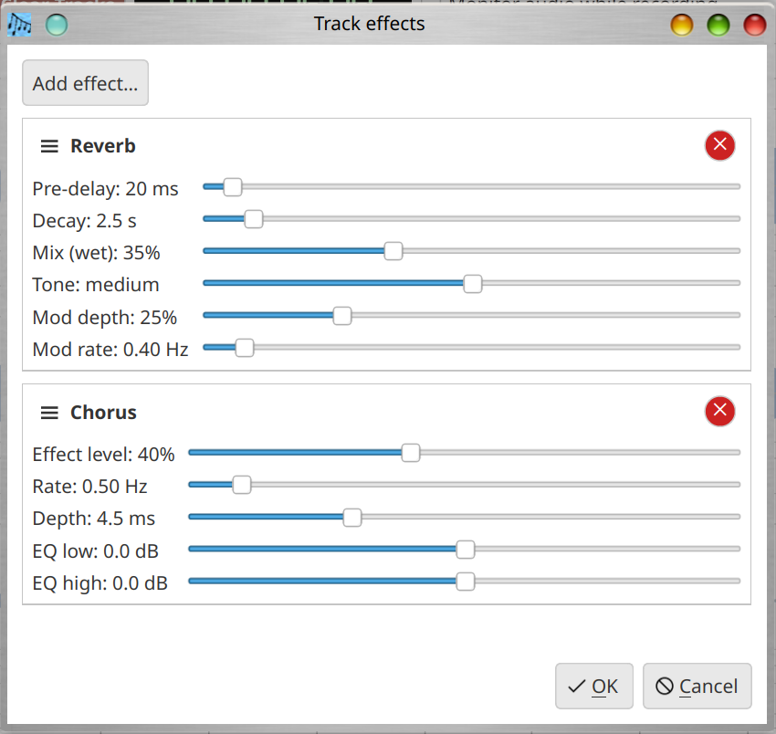

# Llawlyfr Defnyddiwr Musician's Canvas

## Cyflwyniad

Mae Musician's Canvas yn gymhwysiad recordio cerddoriaeth aml-drac ar gyfer cyfrifiaduron bwrdd gwaith. Mae'n cefnogi recordio sain o feicroffonau a dyfeisiau line-in, recordio MIDI o fysellfyrddau a rheolyddion, a chymysgu'r holl draciau i ffeil WAV neu FLAC sengl. Mae cymhwysiad cydymaith, Virtual MIDI Keyboard, yn darparu bysellfwrdd piano meddalwedd ar gyfer anfon nodau MIDI.

Mae Musician's Canvas wedi'i ddylunio ar gyfer hawster defnydd tra'n darparu nodweddion a geir yn gyffredin mewn gorsafoedd gwaith sain digidol (DAWs):

- Recordio sain a MIDI aml-drac
- Recordio overdub gyda chwarae'n ôl wedi'i gydamseru o draciau presennol
- Synth MIDI FluidSynth adeiledig gyda chefnogaeth SoundFont
- Trawsnewid cyfradd samplu o ansawdd uchel ar gyfer recordio ar unrhyw gyfradd samplu prosiect
- Canfod dyfais mono/stereo yn awtomatig
- Gosodiadau sy'n seiliedig ar brosiect gyda gorosgyniadau fesul prosiect
- Cymysgu i WAV neu FLAC
- Themâu tywyll a golau
- Wedi'i leoleiddio mewn sawl iaith (Saesneg, Almaeneg, Sbaeneg, Ffrangeg, Siapanëeg, Portiwgaleg, Tsieinëeg, a Môr-ladron)
- Cymhwysiad cydymaith Virtual MIDI Keyboard

## Dechrau Arni

### Lansio'r Cymhwysiad

Rhedwch y ffeil weithredadwy `musicians_canvas` o'r cyfeiriadur adeiladu neu eich lleoliad gosod:

```
./musicians_canvas
```

Ar y lansiad cyntaf, mae'r cymhwysiad yn agor gyda phrosiect gwag. Bydd angen i chi osod cyfeiriadur prosiect cyn recordio.

Ar gychwyn, mae'r cymhwysiad yn cymhwyso'r thema a gadwyd (tywyll neu olau) ac, os defnyddiwyd cyfeiriadur prosiect o'r blaen ac mae'n cynnwys ffeil `project.json`, mae'r prosiect yn cael ei lwytho'n awtomatig.

### Sefydlu Prosiect

1. **Gosodwch y cyfeiriadur prosiect**: Rhowch neu porwch i ffolder yn y maes "Project Location" ar frig y ffenestr. Dyma lle bydd recordiadau a'r ffeil prosiect yn cael eu storio.

2. **Ychwanegwch drac**: Cliciwch y botwm **+ Add Track**. Mae trac newydd yn ymddangos gyda gosodiadau rhagosodedig. Os mai dyma'r unig drac yn y prosiect ac nad yw wedi'i recordio eto, mae'n cael ei arfogi'n awtomatig ar gyfer recordio.

3. **Enwch y trac**: Teipiwch enw yn y maes testun wrth ymyl y botwm "Options". Defnyddir yr enw hwn fel enw ffeil ar gyfer y ffeil sain a recordiwyd.


### Bar Botymau

Yn union o dan y bar dewislen mae bar offer gyda botymau mynediad cyflym:


- **Open Project**: Yr un peth â **File > Open Project** — mae'n agor prosiect a gadwyd yn flaenorol.
- **Save Project**: Yr un peth â **File > Save Project** — mae'n cadw'r prosiect cyfredol.
  Dim ond pan fo cyfeiriadur prosiect wedi'i osod y caiff y botwm hwn ei alluogi.
- **Project Settings**: Yr un peth â **Project > Project Settings** — mae'n agor y ddeialog
  gosodiadau prosiect. Dim ond pan fo cyfeiriadur prosiect wedi'i osod y caiff y botwm hwn ei alluogi.
- **Configuration**: Yr un peth â **Settings > Configuration** — mae'n agor y ddeialog
  gosodiadau byd-eang yr ap.
- **Metronome Settings**: Mae'n agor y ddeialog gosodiadau metronom (gweler yr adran Metronom isod).

### Cadw ac Agor Prosiectau

- **Cadw**: Defnyddiwch **File > Save Project** (Ctrl+S) i gadw'r prosiect cyfredol fel ffeil JSON yn y cyfeiriadur prosiect.
- **Agor**: Defnyddiwch **File > Open Project** (Ctrl+O) i lwytho prosiect a gadwyd yn flaenorol.

Mae'r ffeil prosiect (`project.json`) yn storio enwau traciau, mathau, nodau MIDI, cyfeiriadau ffeiliau sain, a'r holl osodiadau sy'n benodol i'r prosiect. Mae ffeiliau sain yn cael eu storio yn yr un cyfeiriadur â `project.json` ac yn cael eu henwi ar ôl eu traciau (e.e., `My_Track.flac`).

Os byddwch yn cau'r cymhwysiad gyda newidiadau heb eu cadw, mae deialog gadarnhau yn gofyn a ydych am gadw cyn gadael.

## Rheoli Traciau

### Ychwanegu a Dileu Traciau

- Cliciwch **+ Add Track** i ychwanegu trac newydd at y trefniant.
- Cliciwch y botwm **x** ar ochr dde rhes trac i'w ddileu.
- Cliciwch **Clear Tracks** (y botwm coch yn y bar offer) i ddileu'r holl draciau. Dangosir deialog gadarnhau cyn bwrw ymlaen.

### Ychwanegu Traciau trwy Lusgo a Gollwng

Tra bod prosiect ar agor, gallwch lusgo un neu fwy o ffeiliau sain a gefnogir
o'ch rheolwr ffeiliau (Windows Explorer, macOS Finder, rheolwr ffeiliau Linux,
ac ati) yn uniongyrchol i ffenestr Musician's Canvas i'w hychwanegu fel traciau
sain newydd.

- **Fformatau a gefnogir:** `.wav` a `.flac`. Caiff ffeiliau mewn unrhyw
  fformat arall eu hepgor yn dawel, ac mae deialog ar y diwedd yn rhestru pa
  ffeiliau a hepgorwyd.
- **Copïo ffeiliau:** Os nad yw'r ffeil a ollyngwyd eisoes yng nghyfeiriadur y
  prosiect, caiff ei chopïo yno yn awtomatig. Os oes ffeil â'r un enw eisoes
  yng nghyfeiriadur y prosiect, gofynnir i chi a ydych am ei disodli.
- **Enw'r trac:** Defnyddir enw sylfaen y ffeil (heb yr estyniad) fel enw'r
  trac newydd. Er enghraifft, mae gollwng `Bass Line.wav` yn creu trac sain
  o'r enw "Bass Line".
- **Sawl ffeil ar unwaith:** Gellir llusgo sawl ffeil gyda'i gilydd; mae pob
  ffeil a gefnogir yn dod yn drac ei hun mewn un gollyngiad.
- **Pan wrthodir y gollyngiad:** Dim ond pan fydd prosiect ar agor a phan
  fydd Musician's Canvas **heb** fod yn chwarae nac yn recordio ar hyn o
  bryd y derbynnir gollyngiadau. Stopiwch y chwarae neu'r recordio yn gyntaf
  os ydych am lusgo traciau ychwanegol i mewn.

### Ffurfweddu Math Trac

Gellir ffurfweddu pob trac fel **Audio** (ar gyfer recordio meicroffon/line-in) neu **MIDI** (ar gyfer recordio bysellfwrdd/rheolydd).

I newid y math trac:

- Cliciwch y botwm **Options** ar y trac, neu
- Cliciwch yr **eicon math trac** (rhwng "Options" a'r maes enw)

Mae hyn yn agor y ddeialog Ffurfweddu Trac lle gallwch ddewis y ffynhonnell fewnbwn.


### Rheolaethau Trac

Mae pob rhes trac yn darparu'r rheolaethau canlynol:

- **Blwch ticio galluogi**: Toglo a yw'r trac wedi'i gynnwys mewn chwarae'n ôl a chymysgu. Mae analluogi trac hefyd yn ei ddarfogi'n awtomatig os oedd wedi'i arfogi.
- **Botwm radio arfogi**: Dewis y trac hwn fel y targed recordio. Dim ond un trac all fod wedi'i arfogi ar y tro; mae arfogi trac newydd yn darfogi unrhyw drac a arfogwyd yn flaenorol yn awtomatig.
- **Maes enw**: Maes testun y gellir ei olygu ar gyfer enw'r trac. Defnyddir yr enw hwn fel enw'r ffeil sain (gyda chymeriadau system ffeiliau annilys yn cael eu disodli gan danlinellau).
- **Botwm Options**: Agor y ddeialog Ffurfweddu Trac.
- **Eicon math**: Dangos eicon seinydd ar gyfer traciau sain neu eicon piano ar gyfer traciau MIDI. Mae clicio arno yn agor y ddeialog Ffurfweddu Trac.
- **Botwm dileu (x)**: Dileu'r trac o'r prosiect.

### Awtomatig-Arfogi

Pan fo gan brosiect un trac yn union ac nad yw'r trac hwnnw wedi'i recordio eto, mae'n cael ei arfogi'n awtomatig ar gyfer recordio. Mae hyn yn berthnasol wrth ychwanegu'r trac cyntaf at brosiect newydd ac wrth agor prosiect presennol sydd ag un trac gwag.

### Delweddu Trac

- Mae **traciau sain** yn arddangos delweddiad tonnffurf o'r sain a recordiwyd. Pan nad oes sain wedi'i recordio, mae'r ardal yn dangos "No audio recorded".
- Mae **traciau MIDI** yn arddangos delweddiad piano roll sy'n dangos nodau a recordiwyd ar grid sy'n rhychwantu A0 i C8. Mae nodau wedi'u lliwio yn ôl cyflymder. Pan nad oes data MIDI wedi'i recordio, mae'r ardal yn dangos "No MIDI data recorded".

## Recordio

### Recordio Sain

1. Sicrhewch fod y cyfeiriadur prosiect wedi'i osod.
2. Arfogwch y trac targed (ticiwch y botwm radio "Arm").
3. Cliciwch y botwm **Record** (cylch coch).
4. Mae cyfrif i lawr o 3 eiliad yn ymddangos ar y trac ("Get ready... 3", "2", "1"), yna mae recordio'n dechrau.
5. Yn ystod recordio, dangosir mesurydd lefel byw yn ardal tonnffurf y trac, yn dangos yr osgled gyfredol fel bar graddiant (gwyrdd i felyn i goch) gyda label "Recording".
6. Cliciwch y botwm **Stop** i orffen recordio.

Mae'r sain a recordiwyd yn cael ei chadw fel ffeil FLAC yn y cyfeiriadur prosiect, wedi'i enwi ar ôl y trac.

Yn ystod recordio a chwarae'n ôl, mae'r holl reolaethau rhyngweithiol (botymau traciau, gosodiadau, ayyb) wedi'u hanalluogi i atal newidiadau damweiniol.

### Effeithiau mewnosod (traciau sain yn unig)

Mae botwm **Effeithiau** ar draciau sain union dan **Options**. Mae'n agor y ddeialog **Effeithiau trac**, lle rydych chi'n adeiladu **cadwyn wedi'i threfnu** o effeithiau mewnosod ar gyfer recordio ar y trac hwnnw:



- **Ychwanegu effaith…** a dewiswch **Reverb**, **Chorus** neu **Flanger**. Mae sawl enghraifft yn cael ei chaniatáu; mae'r **✕** coch yn y pennyn yn dileu effaith.
- Llusgwch **≡** i **aildrefnu**. Mae'r **effaith uchaf** yn **cychwyn gyntaf**.
- Mae ms a Hz yn parhau'n ystyrlon ar ôl trosi i **gyfradd samplu'r prosiect**. Cefnogir **mono** a **stereo** (mae mono'n cael ei brosesu fel dwy-lwybr mono ac yn cael ei gymysgu'n ôl i un sianel).
- **Iawn** yn cadw yn y prosiect; **Canslo** yn adfer y gadwyn fel pan agorwyd y ddeialog.

Cynnir effeithiau **pan fyddwch chi'n stopio recordio**, ar ôl cipio ac ailsampla fel arfer. Mae'r ffurfweddiad yn cael ei gadw yn `project.json` dan `audioEffectChain`.

### Monitro wrth recordio

Wrth ymyl **arddangosfa'r amser**, mae **Monitro sain wrth recordio** yn pennu a yw **mewnbwn byw** yn mynd i **allbwn sain y prosiect**
wrth recordio:

- **Traciau sain**: chwaraeir y mewnbwn mewn amser real (yr un broses recordio). Gall ail chwarae **overdub** ddod ar ei ben.
- **Traciau MIDI**: gyda **Rendro MIDI i sain ar gyfer chwarae'n ôl** a **SoundFont** wedi'i osod, cewch glywed nodau trwy'r syntheseisydd meddalwedd. Gyda **allbwn MIDI allanol** — defnyddiwch fonitro eich offer.

Mae'r dewis yn cael ei **gedw yn y prosiect** (`monitorWhileRecording` yn `project.json`). Diffoddwch i leihau adborth meicroffon.

#### Recordio Overdub

Wrth recordio trac newydd tra bod traciau galluogedig eraill eisoes yn cynnwys data sain neu MIDI, mae Musician's Canvas yn cyflawni recordio overdub: mae'r traciau presennol yn cael eu cymysgu gyda'i gilydd a'u chwarae'n ôl mewn amser real tra bod y trac newydd yn cael ei recordio. Mae hyn yn caniatáu i chi glywed rhannau a recordiwyd yn flaenorol wrth osod un newydd i lawr.

Mae'r cymysgedd o draciau presennol yn cael ei baratoi cyn i'r cipio ddechrau, felly mae recordio a chwarae'n ôl yn dechrau ar tua'r un eiliad, gan gadw'r holl draciau wedi'u cydamseru.

#### Backends Recordio

Mae Musician's Canvas yn cefnogi dau backend cipio sain:

- **PortAudio** (rhagosodedig pan fo ar gael): Yn darparu recordio dibynadwy, hwyrni isel ac mae'n backend a argymhellir.
- **Qt Multimedia**: Backend wrth gefn sy'n defnyddio cipio sain adeiledig Qt. Fe'i defnyddir pan nad yw PortAudio ar gael neu pan ddewisir ef yn benodol yng Ngosodiadau'r Prosiect.

Gellir ffurfweddu'r backend recordio fesul prosiect yn **Project > Project Settings > Audio**.

#### Cyfradd Samplu a Thrin Dyfeisiau

Mae Musician's Canvas yn recordio ar gyfradd samplu frodorol y ddyfais fewnbwn sain ac yna'n trawsnewid yn awtomatig i gyfradd samplu ffurfweddig y prosiect gan ddefnyddio ailsamplu o ansawdd uchel. Mae hyn yn golygu y gallwch osod unrhyw gyfradd samplu prosiect (e.e., 44100 Hz neu 48000 Hz) waeth beth yw cyfradd frodorol y ddyfais. Mae'r trawsnewidiad yn cadw traw a hyd yn union.

#### Canfod Dyfais Mono

Mae rhai dyfeisiau sain (e.e., meicroffonau gwe-gamera USB) yn ffisegol mono ond yn cael eu hysbysebu fel stereo gan y system weithredu. Mae Musician's Canvas yn canfod hyn yn awtomatig ac yn addasu'r cyfrif sianeli yn unol â hynny. Os yw'r prosiect wedi'i ffurfweddu ar gyfer stereo, mae'r signal mono yn cael ei ddyblygu i'r ddwy sianel.

### Recordio MIDI

1. Gosodwch fath y trac i **MIDI** trwy'r botwm Options.
2. Sicrhewch fod dyfais fewnbwn MIDI wedi'i ffurfweddu yn **Settings > Configuration > MIDI**.
3. Arfogwch y trac a chliciwch Record.
4. Chwaraewch nodau ar eich rheolydd MIDI.
5. Cliciwch Stop i orffen recordio.

Dangosir nodau MIDI mewn delweddiad piano roll ar y trac.

## Metronom

Mae Musician's Canvas yn cynnwys metronom adeiledig y gellir ei ddefnyddio yn ystod recordio
i helpu i gadw amser. Cliciwch ar fotwm y metronom ar y bar botymau (o dan y bar dewislen) i
agor y ddeialog gosodiadau metronom:


Mae'r ddeialog yn darparu:

- **Enable metronome during recording**: Pan fydd wedi'i dicio, mae'r metronom yn chwarae
  sain tic tra bo recordio'n weithredol. Mae'r tic yn cael ei chwarae trwy sain y system
  ac **nid** yw'n cael ei ddal i mewn i'r trac a recordiwyd.
- **Beats per minute**: Mewnbwn rhifol ar gyfer y tempo, mewn curiadau y funud (BPM). Yr
  ystod yw 20–300 BPM.

Pan fydd y metronom wedi'i alluogi, mae'n dechrau ticio unwaith y bydd y recordio'n dechrau
go iawn (ar ôl i'r cyfrif tuag at i lawr 3 eiliad gwblhau), ac yn stopio pan ddaw'r recordio i ben.

## Chwarae'n Ôl

Cliciwch y botwm **Play** i gymysgu a chwarae'n ôl yr holl draciau galluogedig. Mae tooltip y botwm yn newid i ddangos a fydd yn chwarae neu'n recordio yn seiliedig ar p'un a yw trac wedi'i arfogi. Mae traciau analluogedig (heb eu ticio) yn cael eu heithrio o chwarae'n ôl.

Yn ystod chwarae'n ôl, mae traciau sain yn cael eu datgodio o'u ffeiliau FLAC ac mae traciau MIDI yn cael eu rendro i sain gan ddefnyddio'r synth FluidSynth adeiledig. Mae'r holl draciau yn cael eu cymysgu gyda'i gilydd a'u chwarae trwy ddyfais allbwn sain y system.

Cliciwch y botwm **Stop** i orffen chwarae'n ôl ar unrhyw adeg.

## Cymysgu i Ffeil

Defnyddiwch **Tools > Mix tracks to file** (Ctrl+M) i allforio'r holl draciau galluogedig i ffeil sain sengl. Mae deialog yn gadael i chi ddewis y llwybr allbwn a'r fformat:

- **Ffeil allbwn**: Porwch i ddewis llwybr ffeil y cyrchfan.
- **Fformat**: Dewiswch rhwng FLAC (cywasgu di-golled, ffeiliau llai) neu WAV (heb ei gywasgu).

Mae'r cymysgedd yn defnyddio cyfradd samplu ffurfweddig y prosiect. Mae traciau MIDI yn cael eu rendro gan ddefnyddio'r SoundFont ffurfweddig.

## Gosodiadau

### Gosodiadau Byd-eang

Defnyddiwch **Settings > Configuration** (Ctrl+,) i osod rhagosodiadau byd-eang sy'n berthnasol i bob prosiect:


#### Tab General

- **Thema**: Dewiswch rhwng themâu tywyll a golau.

#### Tab Display

- **Lliw'r arddangosfa LED rhifol**: Dewiswch y lliw a ddefnyddir ar gyfer yr arddangosfa amser LED rhifol a ddangosir ar far offer y brif ffenestr. Mae segmentau gweithredol y digidau'n cael eu tynnu yn y lliw a ddewiswyd, ac mae segmentau anweithredol yn cael eu tynnu fel fersiwn bŵl o'r un lliw. Y lliwiau sydd ar gael yw Light Red, Dark Red, Light Green, Dark Green, Light Blue, Dark Blue, Yellow, Orange, Light Cyan a Dark Cyan. Y rhagosodiad yw Light Green.


#### Tab Language

- **Iaith**: Dewiswch iaith arddangos y cymhwysiad. Y rhagosodiad yw "System Default", sy'n defnyddio gosodiad iaith y system weithredu. Yr ieithoedd sydd ar gael yw Saesneg, Deutsch (Almaeneg), Español (Sbaeneg), Français (Ffrangeg), Siapanëeg, Português (Portiwgaleg Brasil), Tsieinëeg (Traddodiadol), Tsieinëeg (Symledig), a Môr-ladron. Mae'r rhyngwyneb yn diweddaru ar unwaith pan fyddwch yn newid yr iaith.


#### Tab MIDI

- **Dyfais Allbwn MIDI**: Dewiswch y synth FluidSynth adeiledig neu ddyfais MIDI allanol. Defnyddiwch y botwm **Refresh** i ailsganio am ddyfeisiau MIDI sydd ar gael.
- **SoundFont**: Porwch i ffeil SoundFont `.sf2` ar gyfer synthesis MIDI. Ar Linux, gellir canfod SoundFont system yn awtomatig os yw'r pecyn `fluid-soundfont-gm` wedi'i osod. Ar Windows a macOS, rhaid i chi ffurfweddu'r llwybr SoundFont â llaw.


#### Tab Audio

- **Dyfais Fewnbwn Sain**: Dewiswch y meicroffon neu'r ddyfais line-in ar gyfer recordio.
- **Dyfais Allbwn Sain**: Dewiswch y seinydd neu'r ddyfais clustffonau ar gyfer chwarae'n ôl.


### Gosodiadau Prosiect

Defnyddiwch **Project > Project Settings** (Ctrl+P) i orosgyn rhagosodiadau byd-eang ar gyfer y prosiect cyfredol yn unig. Mae hyn yn ddefnyddiol ar gyfer prosiectau sydd angen cyfradd samplu benodol, SoundFont, neu ddyfais sain. Mae gosodiadau penodol i'r prosiect yn cael eu cadw y tu mewn i'r ffeil `project.json`.


#### Tab MIDI

- **Dyfais MIDI**: Dewiswch ddyfais MIDI ar gyfer y prosiect hwn, neu gadewch ar y rhagosodiad i ddefnyddio'r gosodiad byd-eang.
- **SoundFont**: Dewiswch ffeil SoundFont ar gyfer y prosiect hwn.
- **Refresh**: Ailsganio am ddyfeisiau MIDI sydd ar gael.

#### Tab Audio

- **Dyfais Fewnbwn Sain**: Dewiswch y ddyfais recordio ar gyfer y prosiect hwn.
- **Backend cipio recordio** (pan fo PortAudio ar gael):
  - **PortAudio (native input)**: Argymhellir. Yn defnyddio'r un llyfrgell sain ag Audacity.
  - **Qt Multimedia**: Opsiwn wrth gefn sy'n defnyddio cipio sain adeiledig Qt.
- **Dyfais Fewnbwn PortAudio**: Wrth ddefnyddio'r backend PortAudio, dewiswch y ddyfais fewnbwn PortAudio benodol.
- **Dyfais Allbwn Sain**: Dewiswch y ddyfais chwarae'n ôl ar gyfer y prosiect hwn.

##### Gosodiadau Fformat Sain

- **Cyfradd samplu**: Dewiswch o gyfraddau safonol (8000 Hz i 192000 Hz). Mae cyfradd frodorol y ddyfais wedi'i labelu "(native)". Mae cyfraddau sydd angen ailsamplu wedi'u labelu "(resampled)". Gallwch ddewis unrhyw gyfradd waeth beth yw gallu'r ddyfais; bydd Musician's Canvas yn ailsamplu'n awtomatig yn ôl yr angen.
- **Sianeli**: Mono neu Stereo. Os mai dim ond mono y mae'r ddyfais yn ei gefnogi, mae'r opsiwn Stereo wedi'i analluogi.


## Dewislenni

### Dewislen File

| Eitem Dewislen  | Llwybr Byr | Disgrifiad                               |
|-----------------|------------|------------------------------------------|
| Save Project    | Ctrl+S     | Cadw'r prosiect cyfredol i ddisg         |
| Open Project    | Ctrl+O     | Agor ffeil prosiect presennol            |
| Close           | Ctrl+Q     | Cau'r cymhwysiad                         |

### Dewislen Project

| Eitem Dewislen                       | Llwybr Byr | Disgrifiad                                       |
|--------------------------------------|------------|--------------------------------------------------|
| Project Settings                     | Ctrl+P     | Ffurfweddu gosodiadau penodol i'r prosiect       |
| Add Demo Data to Selected Track      |            | Ychwanegu nodau MIDI sampl ar gyfer arddangosiad |

### Dewislen Settings

| Eitem Dewislen  | Llwybr Byr | Disgrifiad                                  |
|-----------------|------------|---------------------------------------------|
| Configuration   | Ctrl+,     | Agor gosodiadau byd-eang y cymhwysiad       |

### Dewislen Tools

| Eitem Dewislen         | Llwybr Byr | Disgrifiad                                       |
|------------------------|------------|--------------------------------------------------|
| Mix tracks to file     | Ctrl+M     | Allforio'r holl draciau galluogedig i ffeil      |
| Virtual MIDI Keyboard  |            | Lansio'r cymhwysiad bysellfwrdd cydymaith        |

## Llwybrau Byr Bysellfwrdd

| Llwybr Byr      | Gweithred                       |
|-----------------|--------------------------------|
| Ctrl+S          | Cadw prosiect                   |
| Ctrl+O          | Agor prosiect                   |
| Ctrl+M          | Cymysgu traciau i ffeil         |
| Ctrl+P          | Gosodiadau Prosiect             |
| Ctrl+,          | Gosodiadau / Ffurfweddiad       |
| Ctrl+Q / Alt+F4 | Cau                            |

## Virtual MIDI Keyboard

Mae Virtual MIDI Keyboard yn gymhwysiad cydymaith (`virtual_midi_keyboard`) sy'n darparu bysellfwrdd piano ar y sgrin ar gyfer anfon nodau MIDI. Gellir ei lansio o'r ddewislen **Tools > Virtual MIDI Keyboard** yn y prif gymhwysiad, neu ei redeg yn annibynnol.


### Nodweddion

- Cliciwch allweddi ar y bysellfwrdd piano ar y sgrin i chwarae nodau
- Defnyddiwch fysellfwrdd y cyfrifiadur fel bysellfwrdd piano (gweler y mapio allweddi isod)
- Cysylltu â dyfeisiau allbwn MIDI allanol neu ddefnyddio'r synth FluidSynth adeiledig
- Cysylltu â dyfais fewnbwn MIDI i arddangos nodau sy'n dod i mewn ar y bysellfwrdd
- Cyfaint synth addasadwy (master gain, 10%--200%)
- Dewis SoundFont ar gyfer y synth adeiledig
- Dewis offeryn/rhaglen MIDI (General MIDI neu ragosodiadau SoundFont)
- Nobyn rheoli Chorus/effaith
- Symud wythawdau (-3 i +5)
- Rheolaeth cyfaint MIDI (CC#7, 0--127)

### Rheolaethau Bar Offer

- **Volume**: Cyfaint MIDI (CC#7), addasadwy o 0 i 127 trwy'r blwch troelli.
- **Octave**: Symudwch wythawdau'r bysellfwrdd gan ddefnyddio'r botymau **<** a **>** neu'r blwch troelli. Ystod -3 i +5.
- **Chorus/Effect**: Nobyn cylchdro a maes testun (1--127) i osod lefel y chorus/effaith (MIDI CC#93). Cliciwch **Apply** i anfon y gwerth.
- **Sianel MIDI**: Mae mewnbwn rhifol (1--16) yn dewis y sianel MIDI y mae nodau, newidiadau rhaglen a newidiadau rheoli yn cael eu hanfon arni. Y diofyn yw sianel 1. Mae'r sianel a ddewiswyd yn dod i rym ar unwaith pan fydd yn cael ei newid. Mae dewis rhagosodiad SoundFont tra bod sianel benodol wedi'i dewis yn cymhwyso'r bank/program hwnnw i'r sianel honno, felly gallwch chwarae seiniau gwahanol ar sianelau gwahanol.
- **Drymiau**: Blwch ticio ychydig uwchben y dewisydd sianel MIDI. Pan nad yw wedi'i dicio (y diofyn), y sianel MIDI yw'r un y mae'r defnyddiwr wedi'i dewis. Pan fo wedi'i dicio, mae'r sianel MIDI yn cael ei newid yn awtomatig i sianel 10 — sianel drymiau safonol General MIDI — fel bod unrhyw beth a gaiff ei chwarae yn swnio fel offerynnau taro. Mae dad-dicio'r blwch yn adfer y sianel a oedd wedi'i dewis cyn i Drymiau gael ei alluogi.
- **Dewisydd offeryn**: Dewiswch offeryn MIDI. Wrth ddefnyddio'r synth FluidSynth adeiledig, mae hwn yn dangos rhagosodiadau SoundFont (Bank:Program Name). Pan fo wedi'i gysylltu â dyfais MIDI allanol, mae hwn yn rhestru'r 128 offeryn General MIDI.

### Chwarae gyda Bysellfwrdd y Cyfrifiadur

Mae bysellfwrdd y cyfrifiadur wedi'i fapio i allweddi piano ar draws dwy wythawdau:

**Wythawdau isaf (yn dechrau ar yr wythawdau gyfredol):**

| Allwedd | Nodyn |
|---------|-------|
| Z       | C     |
| S       | C#/Db |
| X       | D     |
| D       | D#/Eb |
| C       | E     |
| V       | F     |
| G       | F#/Gb |
| B       | G     |
| H       | G#/Ab |
| N       | A     |
| J       | A#/Bb |
| M       | B     |

**Wythawdau uchaf (un wythawdau yn uwch):**

| Allwedd | Nodyn |
|---------|-------|
| Q       | C     |
| 2       | C#/Db |
| W       | D     |
| 3       | D#/Eb |
| E       | E     |
| R       | F     |
| 5       | F#/Gb |
| T       | G     |
| 6       | G#/Ab |
| Y       | A     |
| 7       | A#/Bb |
| U       | B     |
| I       | C (wythawdau nesaf) |
| 9       | C#/Db |
| O       | D     |
| 0       | D#/Eb |
| P       | E     |

Mae allweddi'n goleuo'n weledol pan gânt eu gwasgu (mae allweddi gwyn yn troi'n las golau, mae allweddi du'n tywyllu).

### Ffurfweddiad

Agorwch y ddeialog Ffurfweddiad (**Settings > Configuration**, Ctrl+,) i sefydlu dyfeisiau MIDI a sain:


#### Tab MIDI

- **Dyfais Allbwn MIDI**: Dewiswch ddyfais allanol neu gadewch yn wag ar gyfer y synth FluidSynth adeiledig.
- **Dyfais Fewnbwn MIDI**: Dewiswch reolydd i anfon nodau ymlaen at arddangosfa'r bysellfwrdd.
- **Cyfaint y Synth (Master Gain)**: Addaswch lefel allbwn y synth adeiledig (10%--200%).
- **SoundFont**: Porwch i ffeil SoundFont `.sf2` ar gyfer y synth adeiledig.
- **Refresh**: Ailsganio am ddyfeisiau MIDI sydd ar gael.

#### Tab Audio

- **Dyfais Allbwn Sain**: Dewiswch y ddyfais allbwn ar gyfer y synth adeiledig.

#### Tab Language

- **Iaith**: Dewiswch yr iaith arddangos. Mae'r un ieithoedd â Musician's Canvas ar gael. Mae'r rhyngwyneb yn diweddaru ar unwaith pan fyddwch yn newid yr iaith.

### Llwybrau Byr Virtual MIDI Keyboard

| Llwybr Byr | Gweithred                    |
|------------|------------------------------|
| Ctrl+,     | Deialog ffurfweddiad         |
| Ctrl+U     | Cymorth / Gwybodaeth defnydd |
| Ctrl+Q     | Cau                          |

## Cwestiynau a Ofynnir yn Aml (FAQ)

### Sut ydw i'n recordio trac MIDI?

1. Gosodwch **cyfeiriadur y prosiect** (angen ar gyfer cadw).
2. Ychwanegwch neu ddewiswch drac ac agorwch **Options** (neu cliciwch ar eicon y math o drac).
3. Gosodwch y math i **MIDI** a chau'r dialog.
4. O dan **Settings > Configuration > MIDI**, dewiswch **mewnbwn MIDI** (porth caledwedd neu gebl ffug) a **SoundFont** (`.sf2`) ar gyfer chwarae'n ddiweddarach.
5. **Arfogi (Arm)** y trac hwnnw (dim ond un trac yn gallu bod wedi'i arfogi ar y tro).
6. Cliciwch **Record**, aros am y cyfrif i lawr, chwarae ar y rheolwr, yna **Stop**.

Mae'r nodau'n ymddangos yn y piano roll. Mae **File > Save Project** yn ysgrifennu ffeil `.mid` a `project.json` yn ffolder y prosiect.

### Pam mae fy nhraws MIDI'n dawel wrth chwarae?

Mae chwarae'n defnyddio **FluidSynth** gyda **SoundFont** y gosodiadau. Gwiriwch **Settings > Configuration > MIDI** (neu **Project > Project Settings** os oes diystyriadau prosiect): rhaid bod llwybr dilys `.sf2`. Ar Linux efallai y caiff SoundFont y system ei ganfod yn awtomatig; ar Windows a macOS yn aml mae angen dewis y ffeil â llaw.

### Sut mae Virtual MIDI Keyboard yn gysylltiedig â Musician's Canvas?

Maen nhw'n **ddwy raglen ar wahân**. Lansiwch Virtual MIDI Keyboard o **Tools > Virtual MIDI Keyboard** (neu ar ei ben ei hun). I nodau'r bysellfwrdd ar y sgrin **gyrraedd** i Musician's Canvas wrth recordio MIDI, rhaid i'r OS lwybro **allbwn MIDI** y bysellfwrdd i **fewnbwn** mae Musician's Canvas yn ei ddefnyddio — yn aml trwy gebl MIDI ffug neu borthladdoedd cyfatebol yn y ddwy ap. Nid ydyn nhw'n cysylltu'n awtomatig.

### Beth yw'r gwahaniaeth rhwng Configuration a Project Settings?

Mae **Settings > Configuration** yn gosod **rhagosodiadau cyffredinol** (thema, iaith, dyfeisiau MIDI/sain, SoundFont, ac ati). Mae **Project > Project Settings** yn diystyru rhai **ar gyfer y prosiect cyfredol yn unig** ac yn cael ei gadw yn `project.json`. Os yw maes yn aros ar rhagosodiad y prosiect, mae gwerth cyffredinol o Configuration yn berthnasol.

### Pam nad yw llusgo a gollwng yn ychwanegu ffeiliau sain?

Dim ond pan fo **cyfeiriadur prosiect** wedi'i osod ac nad yw Musician's Canvas **yn chwarae na'n recordio** y derbynnir ffeiliau. Mae **`.wav`** a **`.flac`** yn cael eu cefnogi; caiff estyniadau eraill eu hepgor a'u rhestru mewn dialog. Mae pob ffeil yn drac **sain** newydd â'r enw o enw'r ffeil heb yr estyniad.

### Ble mae fy nghofnodion yn cael eu cadw?

Mae sain yn cael ei chadw yn **ffolder y prosiect** fel **`<enw'r_trac>.flac`** (mae nodau fel `/ \ : * ? " < > |` yn cael eu disodli gan danlinell). Mae ffeil y prosiect yn **`project.json`** yn yr un ffolder. Caiff traciau MIDI eu cadw fel **`<enw'r_trac>.mid`** pan fyddwch yn cadw'r prosiect (gyda nodau yn `project.json` hefyd).

### Pa enw ffeil a ddefnyddir pan rendrir MIDI ar gyfer cymysgu?

Wrth **gymysgu** neu **chwarae**, caiff MIDI ei rendro i WAV dros dro yn fewnol yn gyntaf. Os yw llwybr y prosiect yn hysbys, mae Musician's Canvas hefyd yn ysgrifennu **FLAC storfa** yn ffolder y prosiect: **`<enw_trac_glan>.flac`** (yr un rheolau â ffeiliau trac eraill). Mae'r enw'n seiliedig ar **enw'r trac**, nid ID mewnol.

### A allaf recordio dau drac ar yr un pryd?

Na. Dim ond **un** trac yn gallu bod wedi'i **arfogi** ar y tro; mae'n derbyn y recordiad nesaf. Adeiladwch y darn trwy recordio **un ar ôl y llall** (mae **overdub** yn chwarae traciau presennol wrth recordiad newydd).

### A yw'r metronom yn cael ei recordio ar y trac?

Na. Pan fo wedi'i alluogi, caiff y metronom ei chwarae trwy **sain y system** fel cyfeiriad i chi yn unig. **Nid yw'n cael ei gymysgu** i mewn i'r ffeil recordio.

### Pam mae Musician's Canvas yn gofyn am ASIO ar Windows?

Ar Windows mae'r brif raglen yn disgwyl gyrrwr **ASIO** ar gyfer sain dibynadwy o oedi isel. Gosodwch **ASIO4ALL** neu yrrwr y gwneuthurwr os yw gwallau'n digwydd.

### Ble mae Virtual MIDI Keyboard ar macOS?

Yn y **becyn `.app`**, caiff y gweithredadwy Virtual MIDI Keyboard ei **gopïo i mewn i** `Musician's Canvas.app` (**Contents/MacOS/**) fel bod modd dosbarthu un ffolder ap. Agorwch ef o hyd o **Tools > Virtual MIDI Keyboard**.

## Datrys Problemau

### Dim Allbwn Sain

- Gwiriwch fod y ddyfais allbwn sain gywir wedi'i dewis yn Settings > Configuration > Audio.
- Ar Linux, gwiriwch fod PipeWire neu PulseAudio yn rhedeg a bod yr allbwn heb ei fudo. Defnyddiwch `amixer` neu osodiadau sain eich bwrdd gwaith i wirio lefelau cyfaint.
- Ar Windows, sicrhewch fod gyrrwr sain ASIO wedi'i osod (e.e., [ASIO4ALL](https://asio4all.org/) neu yrrwr ASIO a ddarperir gan y gwneuthurwr ar gyfer eich rhyngwyneb sain). Mae Musician's Canvas yn gofyn am ASIO ar gyfer sain hwyrni isel ar Windows.

### Mae Traciau MIDI yn Dawel

- Sicrhewch fod SoundFont (ffeil `.sf2`) wedi'i ffurfweddu yn Settings > Configuration > MIDI.
- Ar Linux, gellir canfod SoundFont system yn awtomatig os yw'r pecyn `fluid-soundfont-gm` wedi'i osod.
- Ar Windows a macOS, rhaid i chi ffurfweddu'r llwybr SoundFont â llaw.

### Mae'r Recordiad yn Swnio'n Ystumedig neu Mae'r Draw yn Anghywir

- Gall hyn ddigwydd pan fo cyfradd samplu frodorol y ddyfais fewnbwn sain yn wahanol i gyfradd ffurfweddig y prosiect. Mae Musician's Canvas yn trin hyn yn awtomatig trwy ailsamplu, ond os bydd problemau'n parhau, ceisiwch osod cyfradd samplu'r prosiect i gyfateb â chyfradd frodorol y ddyfais.
- Mae meicroffonau gwe-gamera USB yn aml â chyfraddau brodorol anarferol (e.e., 32000 Hz). Mae'r cymhwysiad yn canfod y rhain yn awtomatig.
- Os ydych yn defnyddio'r backend Qt Multimedia ac yn profi problemau, ceisiwch newid i'r backend PortAudio yn Project Settings > Audio.

### Nid oes Sain gan Virtual MIDI Keyboard

- Ar Linux gyda PipeWire, sicrhewch fod y pecyn `libpipewire-0.3-dev` wedi'i osod (sydd ei angen ar gyfer integreiddio PipeWire â'r synth FluidSynth).
- Gwiriwch fod SoundFont wedi'i lwytho (gweler y tab MIDI yn y ddeialog ffurfweddiad).
- Gwiriwch fod y ddyfais allbwn sain wedi'i dewis a bod cyfaint y system heb ei fudo.

## Adeiladu o'r Cod Ffynhonnell

Gweler y [README](../README.md) am gyfarwyddiadau adeiladu cyflawn ar gyfer Linux, macOS, a Windows, gan gynnwys yr holl ddibyniaethau gofynnol.
