# Musician's Canvas Användarmanual

## Introduktion

Musician's Canvas är en applikation för flerspårsinspelning av musik för stationära datorer. Den stöder
ljudinspelning från mikrofoner och linjeinenheter, MIDI-inspelning från klaviaturer och kontroller,
samt mixning av alla spår till en enda WAV- eller FLAC-fil. En kompletterande applikation,
Virtual MIDI Keyboard, tillhandahåller ett mjukvarupianoklaviatur för att skicka MIDI-noter.

Musician's Canvas är utformad för att vara enkel att använda och erbjuder samtidigt funktioner som vanligen
finns i digitala ljudarbetsstationer (DAW):

- Flerspårs ljud- och MIDI-inspelning
- Överdubinspelning med synkroniserad uppspelning av befintliga spår
- Inbyggd FluidSynth MIDI-synthesizer med SoundFont-stöd
- Högkvalitativ samplingsfrekvenskonvertering för inspelning med valfri projektsamplingsfrekvens
- Automatisk mono/stereo-enhetsdetektering
- Projektbaserade inställningar med projektspecifika åsidosättningar
- Mixa till WAV eller FLAC
- Mörka och ljusa teman
- Lokaliserad på flera språk (engelska, tyska, spanska, franska, japanska, portugisiska, kinesiska och Pirate)
- Kompletterande applikation Virtual MIDI Keyboard

## Komma igång

### Starta applikationen

Kör den körbara filen `musicians_canvas` från byggkatalogen eller din installationsplats:

```
./musicians_canvas
```

Vid första start öppnas applikationen med ett tomt projekt. Du behöver ange en projektkatalog innan inspelning.

Vid start tillämpar applikationen det sparade temat (mörkt eller ljust) och, om en projektkatalog tidigare
har använts och innehåller en `project.json`-fil, laddas projektet automatiskt.

### Konfigurera ett projekt

1. **Ange projektkatalogen**: Skriv in eller bläddra till en mapp i fältet "Project Location" högst upp i
   fönstret. Det är här inspelningar och projektfilen kommer att lagras.

2. **Lägg till ett spår**: Klicka på knappen **+ Add Track**. Ett nytt spår visas med standardinställningar.
   Om det är det enda spåret i projektet och det inte har spelats in ännu, förbereds det automatiskt
   för inspelning.

3. **Namnge spåret**: Skriv ett namn i textfältet bredvid knappen "Options". Detta namn används som
   filnamn för den inspelade ljudfilen.

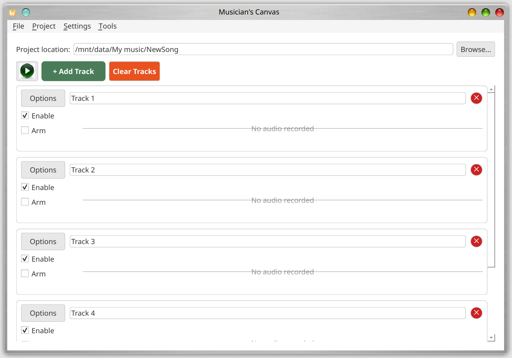

### Knapprad

Direkt under menyraden finns ett verktygsfält med snabbåtkomstknappar:


- **Open Project**: Samma som **File > Open Project** — öppnar ett tidigare sparat projekt.
- **Save Project**: Samma som **File > Save Project** — sparar det aktuella projektet. Den
  här knappen är bara aktiverad när en projektkatalog är angiven.
- **Project Settings**: Samma som **Project > Project Settings** — öppnar dialogrutan för
  projektinställningar. Den här knappen är bara aktiverad när en projektkatalog är angiven.
- **Configuration**: Samma som **Settings > Configuration** — öppnar dialogrutan för globala
  programinställningar.
- **Metronome Settings**: Öppnar dialogrutan för metronominställningar (se avsnittet Metronom nedan).

### Spara och öppna projekt

- **Spara**: Använd **File > Save Project** (Ctrl+S) för att spara det aktuella projektet som en JSON-fil
  i projektkatalogen.
- **Öppna**: Använd **File > Open Project** (Ctrl+O) för att ladda ett tidigare sparat projekt.

Projektfilen (`project.json`) lagrar spårnamn, typer, MIDI-noter, ljudfilreferenser och alla
projektspecifika inställningar. Ljudfiler lagras i samma katalog som `project.json` och namnges efter
sina spår (t.ex. `My_Track.flac`).

Om du stänger applikationen med osparade ändringar visas en bekräftelsedialog som frågar om du vill
spara innan du avslutar.

## Spårhantering

### Lägga till och ta bort spår

- Klicka på **+ Add Track** för att lägga till ett nytt spår i arrangemanget.
- Klicka på knappen **x** på höger sida av en spårrad för att ta bort det.
- Klicka på **Clear Tracks** (den röda knappen i verktygsfältet) för att ta bort alla spår. En
  bekräftelsedialog visas innan åtgärden utförs.

### Lägga till spår genom dra och släpp

När ett projekt är öppet kan du dra en eller flera filer med stödda ljudformat
från din filhanterare (Windows Utforskaren, macOS Finder, Linux-filhanterare
osv.) direkt till Musician's Canvas-fönstret för att lägga till dem som nya
ljudspår.

- **Stödda format:** `.wav` och `.flac`. Filer i andra format hoppas över
  tyst, och en dialogruta i slutet listar vilka filer som hoppades över.
- **Filkopiering:** Om den släppta filen inte redan finns i projektmappen
  kopieras den dit automatiskt. Om en fil med samma namn redan finns i
  projektmappen blir du tillfrågad om du vill ersätta den.
- **Spårnamn:** Filens basnamn (utan filändelsen) används som namn på det
  nya spåret. Att släppa `Bass Line.wav` skapar till exempel ett ljudspår
  som heter "Bass Line".
- **Flera filer samtidigt:** Flera filer kan dras tillsammans; varje fil med
  stött format blir sitt eget spår vid ett enda släpp.
- **När släppet avvisas:** Släpp godtas endast när ett projekt är öppet och
  Musician's Canvas **inte** spelar upp eller spelar in för tillfället.
  Stoppa uppspelningen eller inspelningen först om du vill dra in fler spår.

### Konfigurera spårtyp

Varje spår kan konfigureras som antingen **Audio** (för mikrofon-/linjeinspelning) eller
**MIDI** (för klaviatur-/kontrollerinspelning).

Så här ändrar du spårtyp:

- Klicka på knappen **Options** på spåret, eller
- Klicka på **spårtypikonen** (mellan "Options" och namnfältet)

Detta öppnar dialogen för spårkonfiguration där du kan välja ingångskälla.

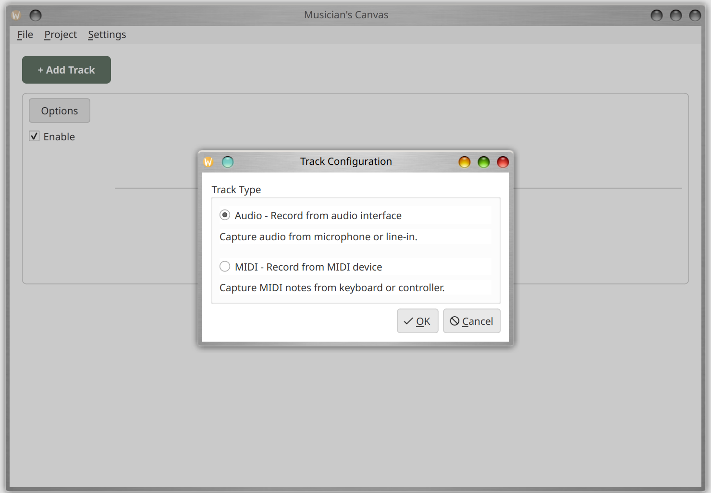

### Spårkontroller

Varje spårrad innehåller följande kontroller:

- **Aktivera kryssruta**: Växlar om spåret ingår i uppspelning och mixning. Att inaktivera ett spår
  avförbereder det också automatiskt om det var förberett för inspelning.
- **Förberedelseknapp**: Väljer detta spår som inspelningsmål. Bara ett spår kan vara förberett åt gången;
  att förbereda ett nytt spår avförbereder automatiskt det tidigare förberedda spåret.
- **Namnfält**: Redigerbart textfält för spårnamnet. Detta namn används som ljudfilnamn (ogiltiga
  filsystemtecken ersätts med understreck).
- **Options-knapp**: Öppnar dialogen för spårkonfiguration.
- **Typikon**: Visar en högtalarikon för ljudspår eller en pianoikon för MIDI-spår. Att klicka på den
  öppnar dialogen för spårkonfiguration.
- **Ta bort-knapp (x)**: Tar bort spåret från projektet.

### Automatisk förberedelse

När ett projekt har exakt ett spår och det spåret inte har spelats in ännu, förbereds det automatiskt
för inspelning. Detta gäller både när man lägger till det första spåret i ett nytt projekt och när man
öppnar ett befintligt projekt som har ett enda tomt spår.

### Spårvisualisering

- **Ljudspår** visar en vågformsvisualisering av det inspelade ljudet. När inget ljud har spelats in
  visar området "No audio recorded".
- **MIDI-spår** visar en pianorulle-visualisering som visar inspelade noter på ett rutnät som sträcker
  sig från A0 till C8. Noter färgas efter anslagsstyrka. När inga MIDI-data har spelats in visar
  området "No MIDI data recorded".

## Inspelning

### Ljudinspelning

1. Se till att projektkatalogen är angiven.
2. Förbered målspåret (markera "Arm"-radioknappen).
3. Klicka på knappen **Record** (röd cirkel).
4. En 3-sekunders nedräkning visas på spåret ("Get ready... 3", "2", "1"), sedan börjar inspelningen.
5. Under inspelning visas en nivåmätare i realtid i spårets vågformsområde, som visar den aktuella
   amplituden som en gradientfält (grönt till gult till rött) med etiketten "Recording".
6. Klicka på knappen **Stop** för att avsluta inspelningen.

Det inspelade ljudet sparas som en FLAC-fil i projektkatalogen, namngiven efter spåret.

Under inspelning och uppspelning inaktiveras alla interaktiva kontroller (spårknappar, inställningar etc.)
för att förhindra oavsiktliga ändringar.

#### Överdubinspelning

När du spelar in ett nytt spår medan andra aktiverade spår redan innehåller ljud- eller MIDI-data utför
Musician's Canvas överdubinspelning: de befintliga spåren mixas ihop och spelas upp i realtid medan det
nya spåret spelas in. Detta gör att du kan höra tidigare inspelade delar medan du spelar in en ny.

Mixen av befintliga spår förbereds innan inspelningen börjar, så inspelning och uppspelning startar
ungefär samtidigt, vilket håller alla spår synkroniserade.

#### Inspelningsbackend

Musician's Canvas stöder två backend för ljudinspelning:

- **PortAudio** (standard när tillgänglig): Ger tillförlitlig inspelning med låg latens och är den
  rekommenderade backend.
- **Qt Multimedia**: En reservbackend som använder Qt:s inbyggda ljudinspelning. Används när PortAudio
  inte är tillgänglig eller när den uttryckligen väljs i projektinställningarna.

Inspelningsbackend kan konfigureras per projekt i **Project > Project Settings > Audio**.

#### Samplingsfrekvens och enhetshantering

Musician's Canvas spelar in med ljudingångsenhetens nativa samplingsfrekvens och konverterar sedan
automatiskt till projektets konfigurerade samplingsfrekvens med högkvalitativ omsampling. Det innebär
att du kan ställa in valfri projektsamplingsfrekvens (t.ex. 44100 Hz eller 48000 Hz) oavsett enhetens
nativa frekvens. Konverteringen bevarar tonhöjd och varaktighet exakt.

#### Detektering av monoenheter

Vissa ljudenheter (t.ex. USB-webbkameramikrofoner) är fysiskt mono men annonseras som stereo av
operativsystemet. Musician's Canvas detekterar detta automatiskt och justerar kanalantalet därefter.
Om projektet är konfigurerat för stereo dupliceras monosignalen till båda kanalerna.

### MIDI-inspelning

1. Ställ in spårtypen till **MIDI** via Options-knappen.
2. Se till att en MIDI-inmatningsenhet är konfigurerad i **Settings > Configuration > MIDI**.
3. Förbered spåret och klicka på Record.
4. Spela noter på din MIDI-kontroller.
5. Klicka på Stop för att avsluta inspelningen.

MIDI-noter visas i en pianorulle-visualisering på spåret.

## Metronom

Musician's Canvas innehåller en inbyggd metronom som kan användas under inspelning för att
hjälpa till att hålla takten. Klicka på metronomknappen i knappraden (under menyraden) för att
öppna dialogrutan för metronominställningar:

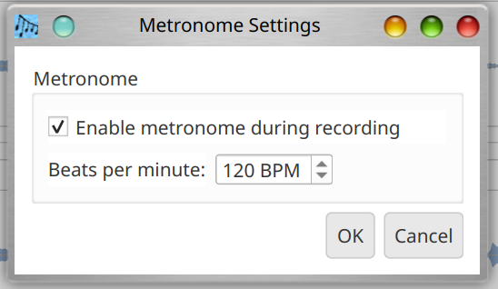

Dialogrutan erbjuder:

- **Enable metronome during recording**: När detta är markerat spelar metronomen ett
  tickljud medan inspelning är aktiv. Ticket spelas genom systemljudet och **tas inte upp**
  på det inspelade spåret.
- **Beats per minute**: En numerisk inmatning för tempot, i slag per minut (BPM). Intervallet
  är 20–300 BPM.

När metronomen är aktiverad börjar den ticka när inspelningen faktiskt startar (efter att
3-sekunders nedräkningen är klar) och stoppar när inspelningen avslutas.

## Uppspelning

Klicka på knappen **Play** för att mixa och spela upp alla aktiverade spår. Knappens verktygstips ändras
för att indikera om den kommer att spela upp eller spela in beroende på om ett spår är förberett.
Inaktiverade spår (omarkerade) exkluderas från uppspelning.

Under uppspelning avkodas ljudspår från sina FLAC-filer och MIDI-spår renderas till ljud med den
inbyggda synthesizern FluidSynth. Alla spår mixas ihop och spelas upp genom systemets ljudutgångsenhet.

Klicka på knappen **Stop** för att avsluta uppspelningen när som helst.

## Mixa till en fil

Använd **Tools > Mix tracks to file** (Ctrl+M) för att exportera alla aktiverade spår till en enda
ljudfil. En dialog låter dig välja utmatningsväg och format:

- **Utmatningsfil**: Bläddra för att välja destinationsfilens sökväg.
- **Format**: Välj mellan FLAC (förlustfri komprimering, mindre filer) eller WAV (okomprimerad).

Mixen använder projektets konfigurerade samplingsfrekvens. MIDI-spår renderas med den konfigurerade
SoundFont.

## Inställningar

### Globala inställningar

Använd **Settings > Configuration** (Ctrl+,) för att ställa in globala standardvärden som gäller för
alla projekt:

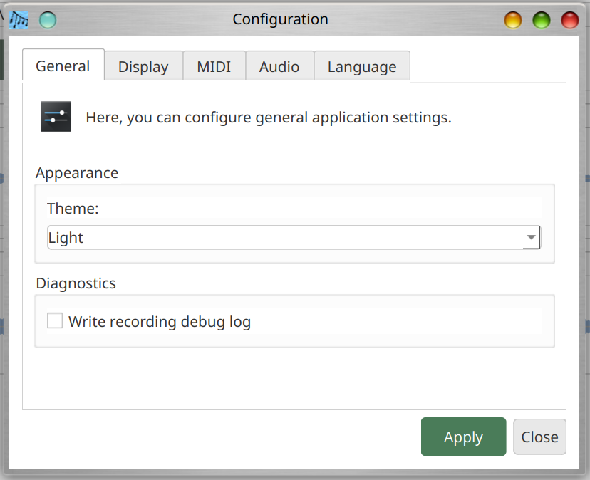

#### Fliken Allmänt

- **Tema**: Välj mellan mörkt och ljust tema.

#### Fliken Visning

- **Färg på numerisk LED-display**: Välj den färg som används för den numeriska LED-tidsdisplayen
  som visas i huvudfönstrets verktygsfält. De aktiva siffersegmenten ritas i den valda färgen, och
  inaktiva segment ritas som en nedtonad version av samma färg. Tillgängliga färger är Light Red,
  Dark Red, Light Green, Dark Green, Light Blue, Dark Blue, Yellow, Orange, Light Cyan och Dark
  Cyan. Standardvärdet är Light Green.

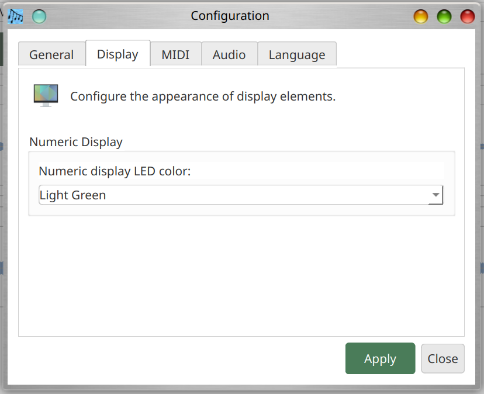

#### Fliken Språk

- **Språk**: Välj visningsspråk för applikationen. Standardvärdet är "System Default", som använder
  operativsystemets språkinställning. Tillgängliga språk är engelska, Deutsch (tyska), Español (spanska),
  Français (franska), japanska, Português (brasiliansk portugisiska), Chinese (traditionell),
  Chinese (förenklad) och Pirate.
  Gränssnittet uppdateras omedelbart när du ändrar språk.

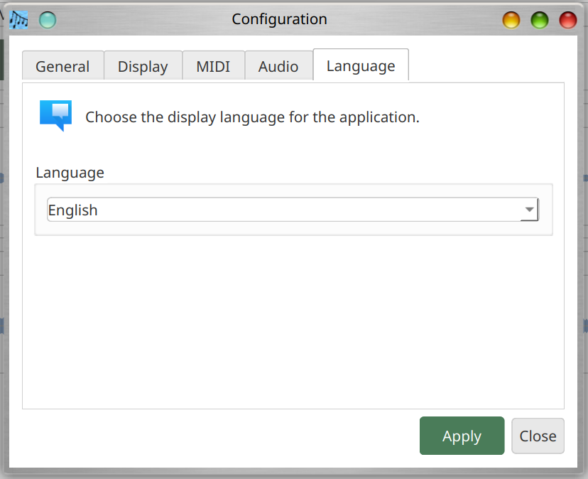

#### Fliken MIDI

- **MIDI-utmatningsenhet**: Välj den inbyggda synthesizern FluidSynth eller en extern MIDI-enhet.
  Använd knappen **Refresh** för att söka efter tillgängliga MIDI-enheter igen.
- **SoundFont**: Bläddra till en `.sf2` SoundFont-fil för MIDI-syntes. I Linux kan en system-SoundFont
  detekteras automatiskt om paketet `fluid-soundfont-gm` är installerat. I Windows och macOS måste du
  konfigurera SoundFont-sökvägen manuellt.

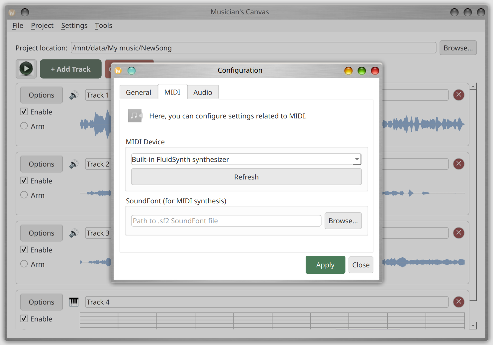

#### Fliken Ljud

- **Ljudingångsenhet**: Välj mikrofon eller linjeinenhet för inspelning.
- **Ljudutgångsenhet**: Välj högtalare eller hörlurar för uppspelning.

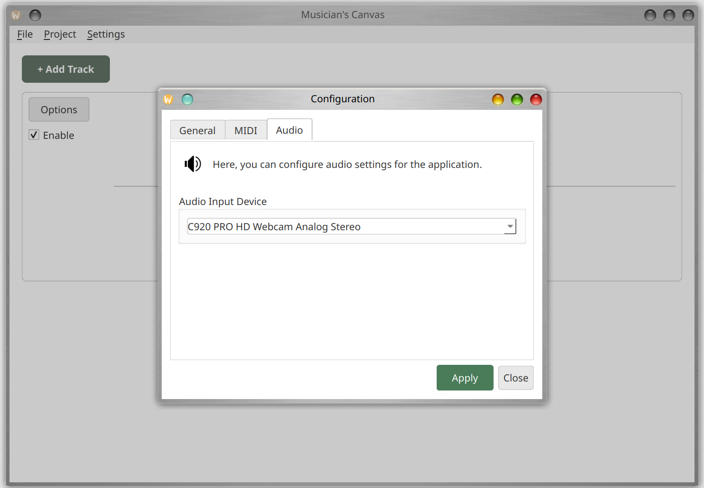

### Projektinställningar

Använd **Project > Project Settings** (Ctrl+P) för att åsidosätta globala standardvärden enbart för det
aktuella projektet. Detta är användbart för projekt som behöver en specifik samplingsfrekvens, SoundFont
eller ljudenhet. Projektspecifika inställningar sparas i filen `project.json`.

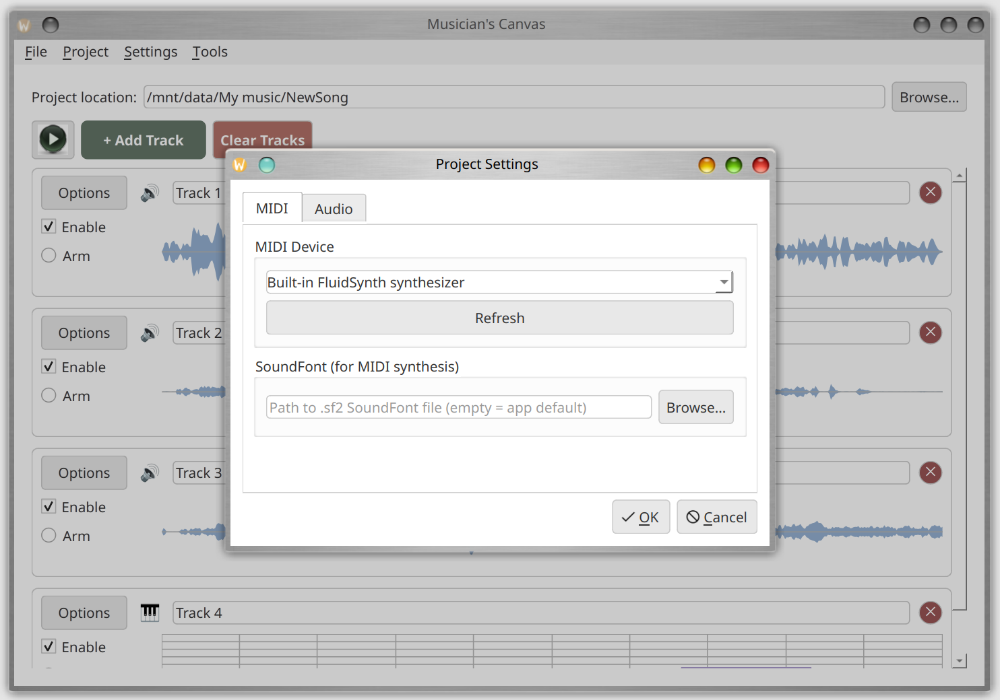

#### Fliken MIDI

- **MIDI-enhet**: Välj en MIDI-enhet för detta projekt, eller lämna på standardvärdet för att använda
  den globala inställningen.
- **SoundFont**: Välj en SoundFont-fil för detta projekt.
- **Refresh**: Sök efter tillgängliga MIDI-enheter igen.

#### Fliken Ljud

- **Ljudingångsenhet**: Välj inspelningsenhet för detta projekt.
- **Backend för inspelning** (när PortAudio är tillgänglig):
  - **PortAudio (native input)**: Rekommenderas. Använder samma ljudbibliotek som Audacity.
  - **Qt Multimedia**: Reservalternativ som använder Qt:s inbyggda ljudinspelning.
- **PortAudio-ingångsenhet**: När PortAudio-backend används, välj den specifika PortAudio-ingångsenheten.
- **Ljudutgångsenhet**: Välj uppspelningsenhet för detta projekt.

##### Inställningar för ljudformat

- **Samplingsfrekvens**: Välj bland standardfrekvenser (8000 Hz till 192000 Hz). Enhetens nativa frekvens
  är märkt "(native)". Frekvenser som kräver omsampling är märkta "(resampled)". Du kan välja valfri
  frekvens oavsett enhetens kapacitet; Musician's Canvas kommer automatiskt att omsampla vid behov.
- **Kanaler**: Mono eller stereo. Om enheten bara stöder mono är stereoalternativet inaktiverat.

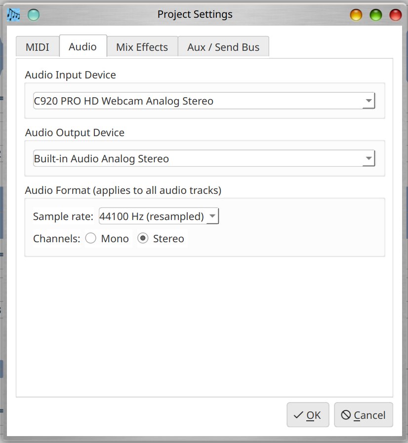

## Menyer

### File-menyn

| Menypost      | Genväg   | Beskrivning                           |
|---------------|----------|---------------------------------------|
| Save Project  | Ctrl+S   | Spara aktuellt projekt till disk      |
| Open Project  | Ctrl+O   | Öppna en befintlig projektfil         |
| Close         | Ctrl+Q   | Avsluta applikationen                 |

### Project-menyn

| Menypost                            | Genväg   | Beskrivning                                    |
|-------------------------------------|----------|-------------------------------------------------|
| Project Settings                    | Ctrl+P   | Konfigurera projektspecifika inställningar      |
| Add Demo Data to Selected Track     |          | Lägg till demo-MIDI-noter för demonstration    |

### Settings-menyn

| Menypost      | Genväg   | Beskrivning                                    |
|---------------|----------|-------------------------------------------------|
| Configuration | Ctrl+,   | Öppna globala applikationsinställningar         |

### Tools-menyn

| Menypost              | Genväg   | Beskrivning                                    |
|------------------------|----------|-------------------------------------------------|
| Mix tracks to file     | Ctrl+M   | Exportera alla aktiverade spår till en fil     |
| Virtual MIDI Keyboard  |          | Starta den kompletterande klaviaturappen       |

## Kortkommandon

| Genväg          | Åtgärd                         |
|-----------------|--------------------------------|
| Ctrl+S          | Spara projekt                  |
| Ctrl+O          | Öppna projekt                  |
| Ctrl+M          | Mixa spår till fil             |
| Ctrl+P          | Projektinställningar           |
| Ctrl+,          | Inställningar / Konfiguration  |
| Ctrl+Q / Alt+F4 | Avsluta                        |

## Virtual MIDI Keyboard

Virtual MIDI Keyboard är en kompletterande applikation (`virtual_midi_keyboard`) som tillhandahåller
ett pianoklaviatur på skärmen för att skicka MIDI-noter. Den kan startas från menyn
**Tools > Virtual MIDI Keyboard** i huvudapplikationen, eller köras fristående.

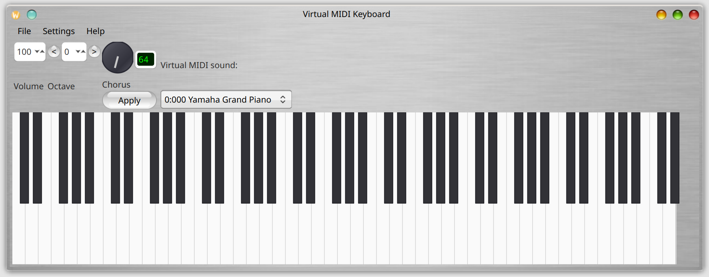

### Funktioner

- Klicka på tangenter på skärmens piano för att spela noter
- Använd datorns tangentbord som ett pianoklaviatur (se tangentmappning nedan)
- Anslut till externa MIDI-utmatningsenheter eller använd den inbyggda synthesizern FluidSynth
- Anslut till en MIDI-inmatningsenhet för att visa inkommande noter på klaviaturen
- Justerbar synthesizer-volym (masterförstärkning, 10%--200%)
- SoundFont-val för den inbyggda synthesizern
- Val av MIDI-instrument/program (General MIDI eller SoundFont-förval)
- Kör/effekt-kontrollratt
- Oktavskiftning (-3 till +5)
- MIDI-volymkontroll (CC#7, 0--127)

### Verktygsfältskontroller

- **Volume**: MIDI-volym (CC#7), justerbar från 0 till 127 via inmatningsrutan.
- **Octave**: Skifta tangentbordets oktav med knapparna **<** och **>** eller inmatningsrutan.
  Intervallet är -3 till +5.
- **Chorus/Effect**: En vridbar ratt och textfält (1--127) för att ställa in kör/effekt-nivån
  (MIDI CC#93). Klicka på **Apply** för att skicka värdet.
- **Instrumentväljare**: Välj ett MIDI-instrument. Vid användning av den inbyggda synthesizern FluidSynth
  visas SoundFont-förval (Bank:Program Namn). Vid anslutning till en extern MIDI-enhet listas de 128
  General MIDI-instrumenten.

### Spela med datorns tangentbord

Datorns tangentbord är mappat till pianotangenter över två oktaver:

**Nedre oktaven (börjar vid aktuell oktav):**

| Tangent | Not   |
|---------|-------|
| Z       | C     |
| S       | C#/Db |
| X       | D     |
| D       | D#/Eb |
| C       | E     |
| V       | F     |
| G       | F#/Gb |
| B       | G     |
| H       | G#/Ab |
| N       | A     |
| J       | A#/Bb |
| M       | B     |

**Övre oktaven (en oktav högre):**

| Tangent | Not   |
|---------|-------|
| Q       | C     |
| 2       | C#/Db |
| W       | D     |
| 3       | D#/Eb |
| E       | E     |
| R       | F     |
| 5       | F#/Gb |
| T       | G     |
| 6       | G#/Ab |
| Y       | A     |
| 7       | A#/Bb |
| U       | B     |
| I       | C (nästa oktav) |
| 9       | C#/Db |
| O       | D     |
| 0       | D#/Eb |
| P       | E     |

Tangenter lyser upp visuellt när de trycks ned (vita tangenter blir ljusblå, svarta tangenter mörknar).

### Konfiguration

Öppna konfigurationsdialogen (**Settings > Configuration**, Ctrl+,) för att konfigurera MIDI- och
ljudenheter:

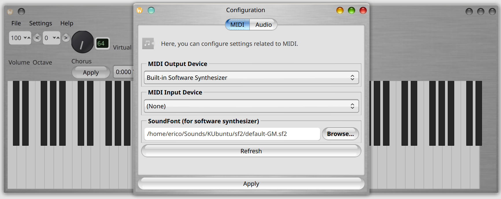

#### Fliken MIDI

- **MIDI-utmatningsenhet**: Välj en extern enhet eller lämna tomt för den inbyggda synthesizern FluidSynth.
- **MIDI-inmatningsenhet**: Välj en kontroller för att vidarebefordra noter till klaviaturvisningen.
- **Synthesizer-volym (masterförstärkning)**: Justera utmatningsnivån för den inbyggda synthesizern
  (10%--200%).
- **SoundFont**: Bläddra till en `.sf2` SoundFont-fil för den inbyggda synthesizern.
- **Refresh**: Sök efter tillgängliga MIDI-enheter igen.

#### Fliken Ljud

- **Ljudutgångsenhet**: Välj utmatningsenhet för den inbyggda synthesizern.

#### Fliken Språk

- **Språk**: Välj visningsspråk. Samma språk som i Musician's Canvas är tillgängliga.
  Gränssnittet uppdateras omedelbart när du ändrar språk.

### Kortkommandon för Virtual MIDI Keyboard

| Genväg   | Åtgärd                   |
|----------|--------------------------|
| Ctrl+,   | Konfigurationsdialog     |
| Ctrl+U   | Hjälp / Användningsinfo  |
| Ctrl+Q   | Stäng                    |

## Felsökning

### Inget ljudutmatning

- Kontrollera att rätt ljudutgångsenhet är vald i Settings > Configuration > Audio.
- I Linux, verifiera att PipeWire eller PulseAudio körs och att utgången inte är tystad. Använd `amixer`
  eller skrivbordets ljudinställningar för att kontrollera volymnivåer.
- I Windows, se till att en ASIO-ljuddrivrutin är installerad (t.ex.
  [ASIO4ALL](https://asio4all.org/) eller en tillverkarspecifik ASIO-drivrutin för ditt ljudgränssnitt).
  Musician's Canvas kräver ASIO för ljud med låg latens i Windows.

### MIDI-spår är tysta

- Se till att en SoundFont (`.sf2`-fil) är konfigurerad i Settings > Configuration > MIDI.
- I Linux kan en system-SoundFont detekteras automatiskt om paketet `fluid-soundfont-gm` är installerat.
- I Windows och macOS måste du konfigurera SoundFont-sökvägen manuellt.

### Inspelningen låter förvrängd eller har fel tonhöjd

- Detta kan hända när ljudingångsenhetens nativa samplingsfrekvens skiljer sig från projektets
  konfigurerade frekvens. Musician's Canvas hanterar detta automatiskt via omsampling, men om problemen
  kvarstår, prova att ställa in projektets samplingsfrekvens så att den matchar enhetens nativa frekvens.
- USB-webbkameramikrofoner har ofta ovanliga nativa frekvenser (t.ex. 32000 Hz). Applikationen
  detekterar dessa automatiskt.
- Om du använder Qt Multimedia-backend och upplever problem, prova att byta till PortAudio-backend
  i Project Settings > Audio.

### Virtual MIDI Keyboard har inget ljud

- I Linux med PipeWire, se till att paketet `libpipewire-0.3-dev` är installerat (behövs för
  PipeWire-integration med synthesizern FluidSynth).
- Kontrollera att en SoundFont är laddad (se fliken MIDI i konfigurationsdialogen).
- Verifiera att ljudutgångsenheten är vald och att systemvolymen inte är tystad.

## Bygga från källkod

Se [README](../README.md) för fullständiga bygginstruktioner för Linux, macOS och Windows,
inklusive alla nödvändiga beroenden.
